# Laporan Praktikum #11 - GUI

## Kompetensi

Setelah menyelesaikan lembar kerja ini mahasiswa diharapkan mampu:

1.	Membuat aplikasi Graphical User Interface sederhana dengan bahasa pemrograman java;

2.	Mengenal komponen GUI seperti frame, label, textfield, combobox, radiobutton, checkbox, textarea, menu, serta table;

3.	Menambahkan event handling pada aplikasi GUI.

## Ringkasan Materi

- Dalam pemrograman GUI terdapat beberapa bagian yang harus dilakukan yaitu:

1.	Membuat windows utama

2.	Menentukan komponen-komponen pendukung program

3.	Menentukan tata letak layout agar nantinya semua komponen – komponen yang sudah dipersiapkan bisa diaatur sedemikian rupa

4.	Event Handling dari sebuah aktivitas, seperti penekanan button, check box dan lain-lain 

- Java Swing merupakan bagian dari JFC (Java Foundation Classes) yang menyediakan API untuk menangani hal yang berkaitan dengan GUI bagi program Java. 

## Percobaan

## Percobaan 1

- Class HelloGui1841720123Zaafril.java

Link kode program : [HelloGui1841720123Zaafril.java](../../src/11_GUI/HelloGui1841720123Zaafril.java)

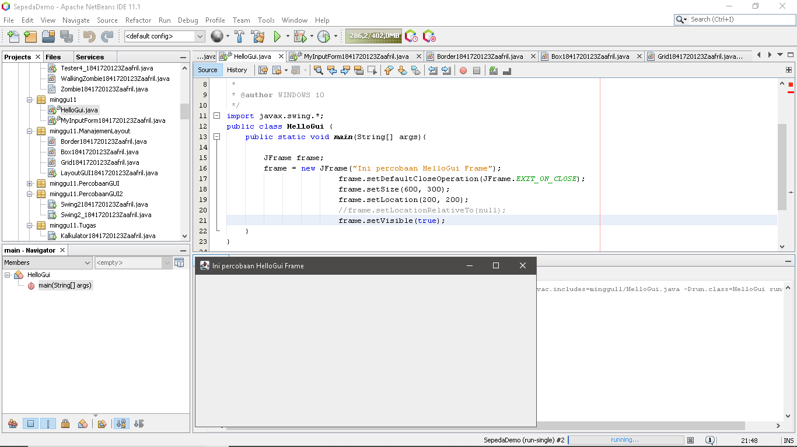

## Percobaan 2

- Main Class, Class MyInputForm1841720123Zaafril.java

Link kode program : [MyInputForm1841720123Zaafril.java](../../src/11_GUI/MyInputForm1841720123Zaafril.java)

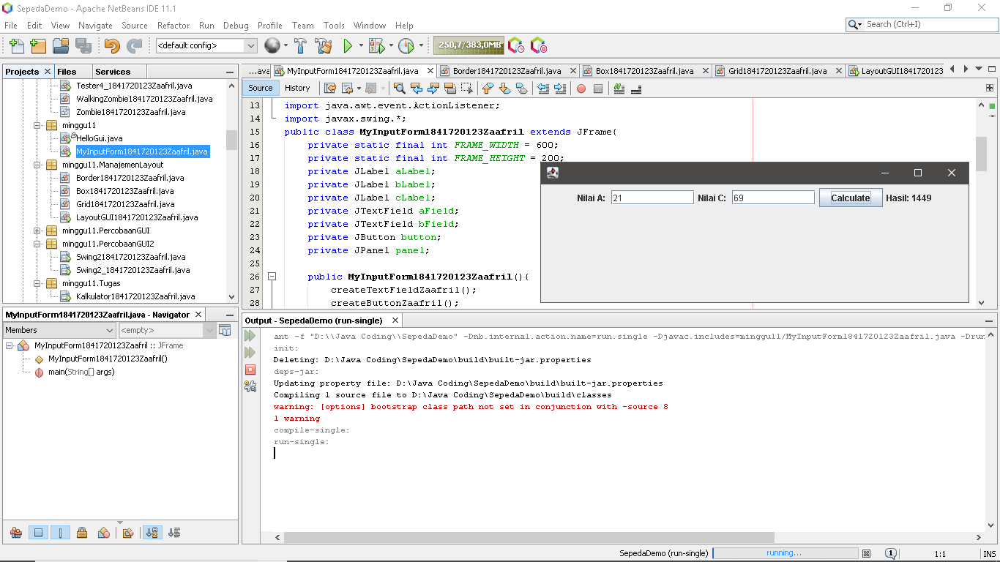

## Pertanyaan Percobaan 2

a)	Modifikasi kode program dengan menambahkan JButton baru untuk melakukan fungsi perhitungan penambahan, sehingga ketika button di klik (event click) maka akan menampilkan hasil penambahan dari nilai A dan B

- 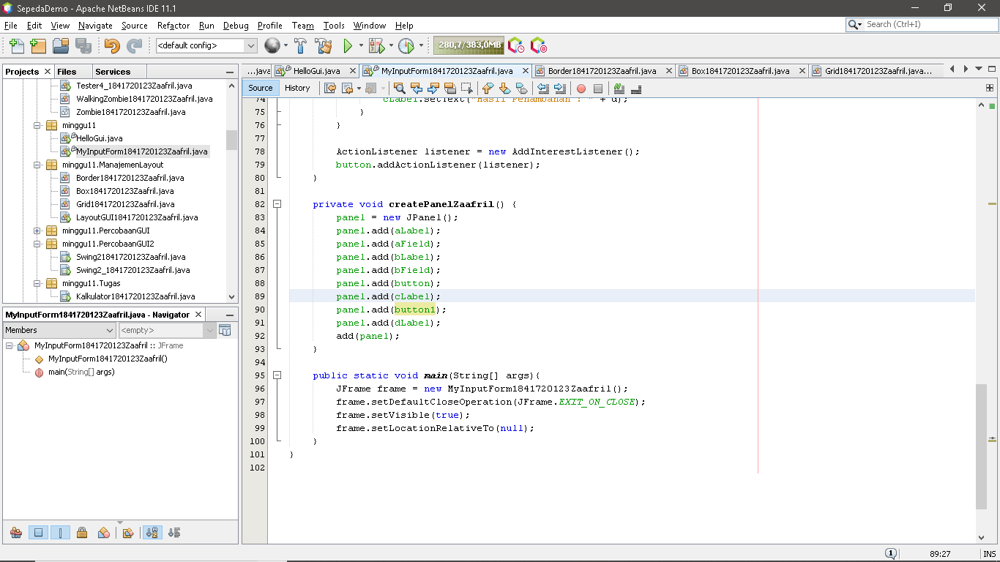

## Percobaan 3

- Class Border1841720123Zaafril.java

Link kode program : [Border1841720123Zaafril.java](../../src/11_GUI/Border1841720123Zaafril.java)

- Class Box1841720123Zaafril.java

Link kode program : [Box1841720123Zaafril.java](../../src/11_GUI/Box1841720123Zaafril.java)

- Class Grid1841720123Zaafril.java

Link kode program : [Grid1841720123Zaafril.java](../../src/11_GUI/Grid1841720123Zaafril.java)

- Main Class, Class LayoutGUI1841720123Zaafril.java

Link kode program : [LayoutGUI1841720123Zaafril.java](../../src/11_GUI/LayoutGUI1841720123Zaafril.java)

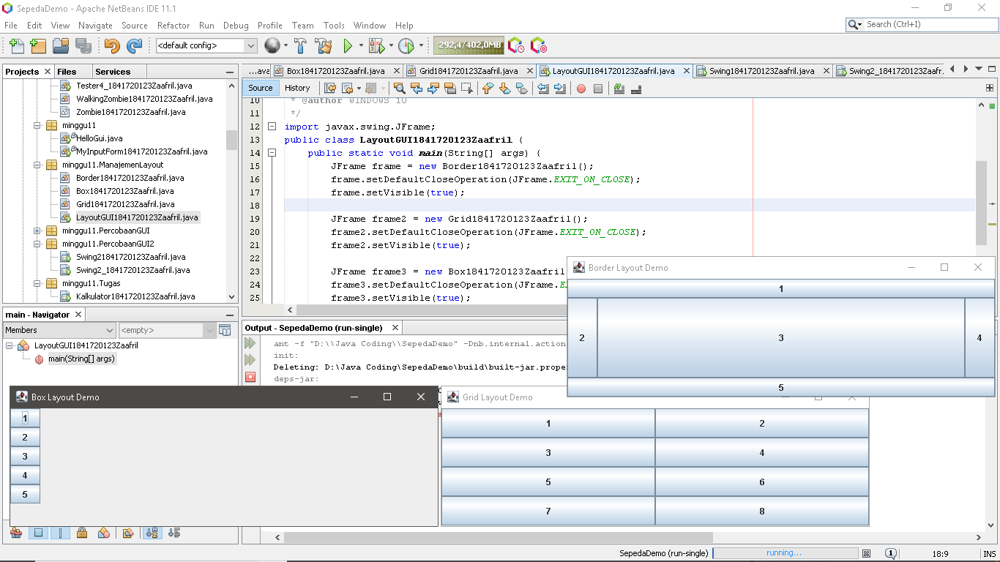

## Pertanyaan Percobaan 3

a)	Apa perbedaan dari Grid Layout, Box Layout dan Border Layout?
- Border yaitu komponen berdasarkan lokasi geografis, NORTH, SOUTH, EAST, WEST, and CENTER. 
- Grid yaitu menempatkan komponen dengan urutan dari kiri ke kanan dan dari atas ke bawah. GridLayout akan memaksa setiap komponen untuk menempati space container yang kosong serta membagi rata ukuran space tersebut
- Box yaitu menempatkan komponen dalam satu baris atau satu kolom.

b)	Apakah fungsi dari masing-masing kode berikut?
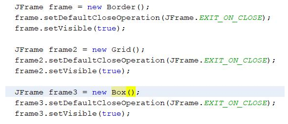

- JFrame frame = new Border(), JFrame frame2 = new Grid(),JFrame frame3 = new Box() 
- frame.setDefaultCloseOperation(JFrame.EXIT_ON_CLOSE) untuk  menentukan operasi ketika frame ditutup
- frame.setVisible(true) untuk  menampilkan frame, dimana parameter berisi tipe data yang bernilai true

## Percobaan 4

- Main Class, Class Swing1841720123Zaafril.java

Link kode program : [Swing1841720123Zaafril.java](../../src/11_GUI/Swing1841720123Zaafril.java)

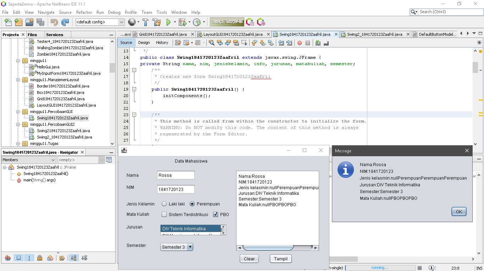

## Pertanyaan Percobaan 4

a)  Apakah fungsi dari kode berikut?
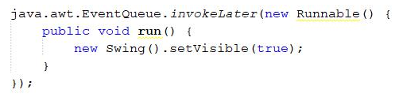

- Membuat set swing visible saat swing  di klik dan menonaktifkan navigasi pada Menu Utama

b)	Mengapa pada bagian logika checkbox dan radio button digunakan multiple if ?
- Sebab terdapat beberapa pilihan, banyak if yang tergantung pilihan yang diinputkan

c)	Lakukan modifikasi pada program untuk melakukan menambahkan inputan berupa alamat dan berikan fungsi pemeriksaan pada nilai Alamat tersebut jika belum diisi dengan menampilkan pesan peringatan
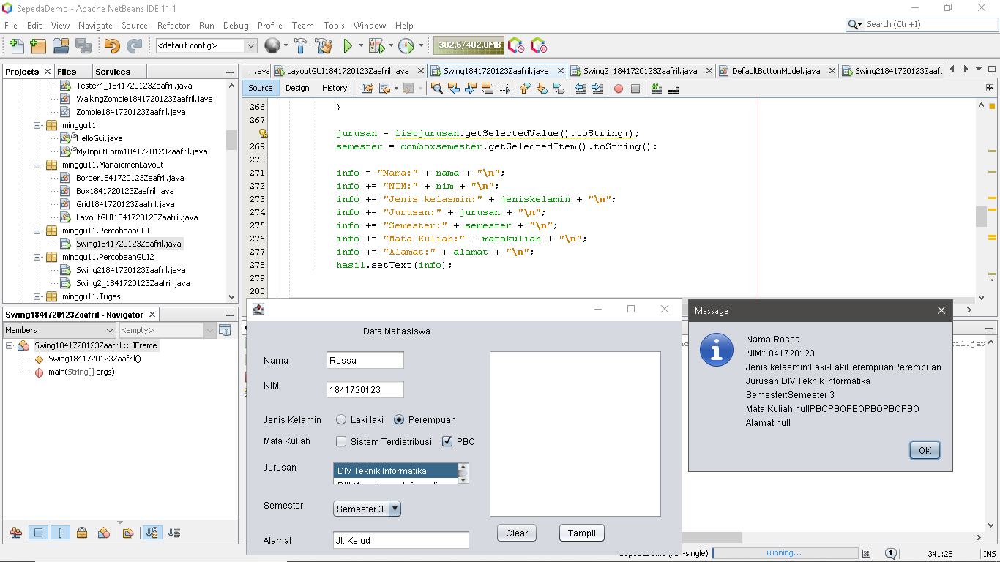

## Percobaan 5

- Main Class, Class Swing21841720123Zaafril.java

Link kode program : [Swing21841720123Zaafril.java](../../src/11_GUI/Swing21841720123Zaafril.java)

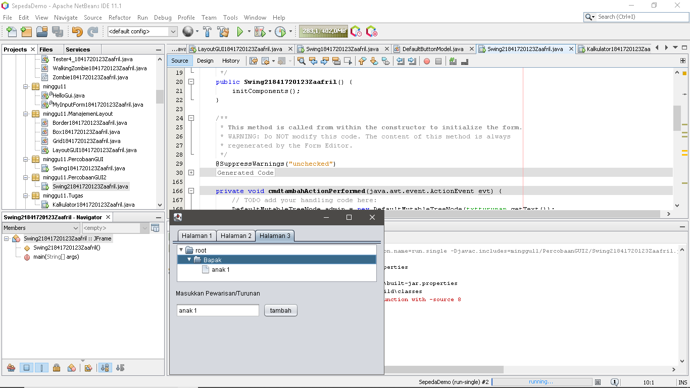

## Pertanyaan Percobaan 5

a)	Apa kegunaan komponen swing JTabPane, JTtree, pada percobaan 5?
- JTabPane adalah panel yang memiliki tab & bisa beralih dari tab 1 ke tab lainnya

- JTree adalah sebuah direktori folder yang tersusun seperti pohon ketika memiliki folder didalam folder

b)	Modifikasi program untuk menambahkan komponen JTable pada tab Halaman 1 dan tab Halaman 2

- 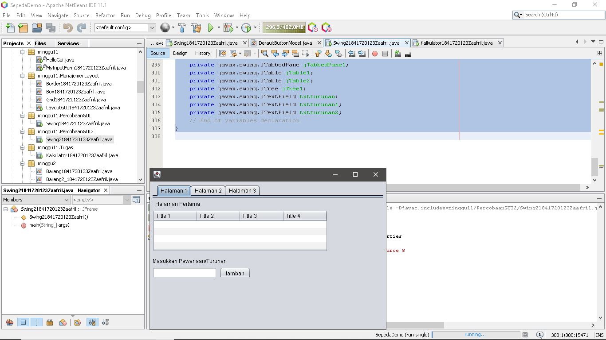
- 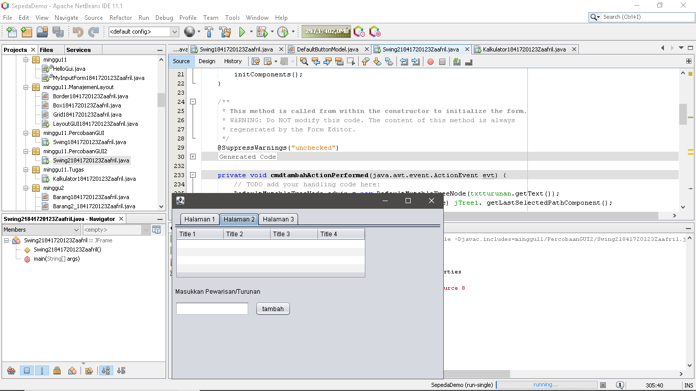

### Tugas

- Main Class, Class Kalkulator1841720123Zaafril.java

Link kode program : [Kalkulator1841720123Zaafril.java](../../src/11_GUI/Kalkulator1841720123Zaafril.java)

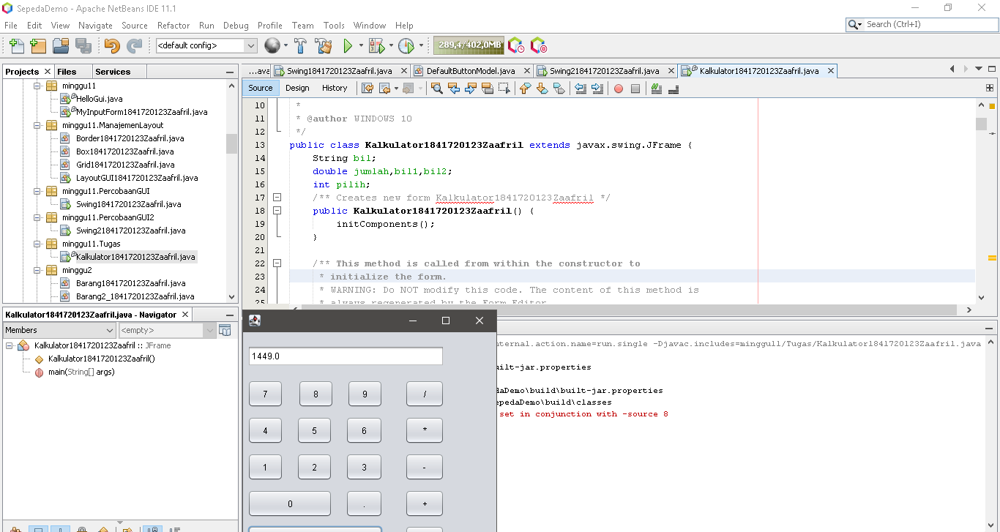

## Kesimpulan

1.	Kita dapat membuat aplikasi Graphical User Interface sederhana dengan bahasa pemrograman java;

2.	Kita dapat mengenal komponen GUI seperti frame, label, textfield, combobox, radiobutton, checkbox, textarea, menu, serta table;

3.	Kita dapat menambahkan event handling pada aplikasi GUI.

## Pernyataan Diri

Saya menyatakan isi tugas, kode program, dan laporan praktikum ini dibuat oleh saya sendiri. Saya tidak melakukan plagiasi, kecurangan, menyalin/menggandakan milik orang lain.

Jika saya melakukan plagiasi, kecurangan, atau melanggar hak kekayaan intelektual, saya siap untuk mendapat sanksi atau hukuman sesuai peraturan perundang-undangan yang berlaku.

Ttd,

***(Muhammad Zaafril Sodik)***

