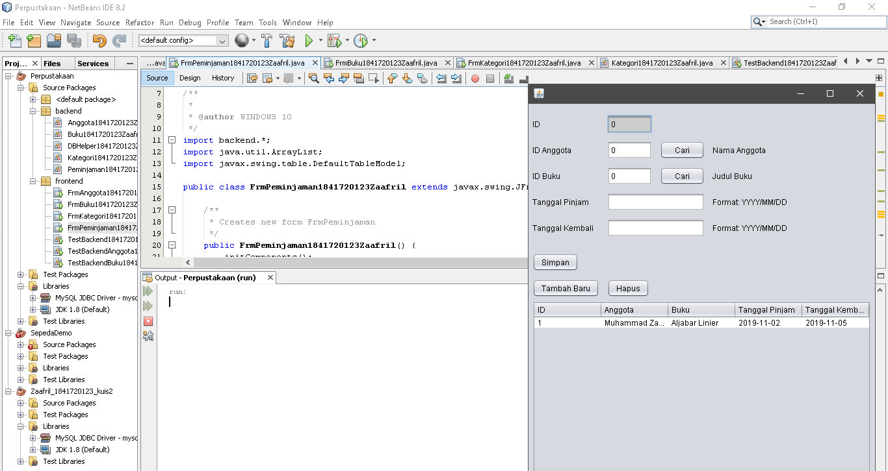

# Laporan Praktikum #14 - GUI dan Database 

## Kompetensi

Setelah menempuh materi percobaan ini, mahasiswa mampu mengenal: 
1. Menggunakan paradigma berorientasi objek untuk interaksi dengan database
2. Membuat backend dan frontend
3. Membuat form sebagai frontend 
 
## Ringkasan Materi

- Paradigma berorientasi objek berfungsi untuk membuat aplikasi berbasis database dan dilengkapi dengan form sebagai Graphical User Interface (GUI).

- Secara umum, tahapan yang akan kita lakukan adalah sebagai berikut:

1.	Membuat database dan tabel-tabelnya.

2.	Membuat backend yang berisi class-class yang mewakili data yang ada pada database, dan class helper untuk melakukan eksekusi query database.

3.	Membuat frontend yang merupakan antarmuka kepada pengguna. Frontend ini bisa berbasis teks (console), GUI, web, mobile, dan sebagainya.

- Library yang digunakan untuk project ini antara lain:

1.	JDBC, untuk melakukan interaksi ke database.

2.	ArrayList, untuk menampung data hasil query ke database.

3.	Swing, untuk membuat tampilan GUI.

## Percobaan

### Percobaan 1

- Database dbperpus.sql

Link kode program : [dbperpus.sql](../../src/14_GUI_dan_Database/dbperpus.sql)

### Percobaan 2

### Percobaan 3

- Class DBHelper1841720123Zaafril.java

Link kode program : [DBHelper1841720123Zaafril.java](../../src/14_GUI_dan_Database/DBHelper1841720123Zaafril.java)

### Percobaan 4

- Class DBHelper1841720123Zaafril.java

Link kode program : [DBHelper1841720123Zaafril.java](../../src/14_GUI_dan_Database/Kategori1841720123Zaafril.java)

### Percobaan 5

- Class TestBackend1841720123Zaafril.java

Link kode program: [TestBackend1841720123Zaafril.java](../../src/14_GUI_dan_Database/TestBackend1841720123Zaafril.java)

### Percobaan 6
- Class Kategori1841720123Zaafril.java

Link kode program: [Kategori1841720123Zaafril.java](../../src/14_GUI_dan_Database/Kategori1841720123Zaafril.java)

- Class FrmKategori1841720123Zaafril.java

Link kode program: [FrmKategori1841720123Zaafril.java](../../src/14_GUI_dan_Database/FrmKategori1841720123Zaafril.java)

- Class Anggota1841720123Zaafril.java

Link kode program: [Anggota1841720123Zaafril.java](../../src/14_GUI_dan_Database/Anggota1841720123Zaafril.java)

- Class TestBackendAnggota1841720123Zaafril.java

Link kode program: [TestBackendAnggota1841720123Zaafril.java](../../src/14_GUI_dan_Database/TestBackendAnggota1841720123Zaafril.java)

### Percobaan 7

- Class FrmAnggota1841720123Zaafril.java

Link kode program: [FrmAnggota1841720123Zaafril.java](../../src/14_GUI_dan_Database/FrmAnggota1841720123Zaafril.java)

- Class Buku1841720123Zaafril.java

Link kode program: [Buku1841720123Zaafril.java](../../src/14_GUI_dan_Database/Buku1841720123Zaafril.java)

- Class TestBackendBuku1841720123Zaafril.java

Link kode program: [TestBackendBuku1841720123Zaafril.java](../../src/14_GUI_dan_Database/TestBackendBuku1841720123Zaafril.java)

### Percobaan 8

- Class FrmBuku1841720123Zaafril.java

Link kode program: [FrmBuku1841720123Zaafril.java](../../src/14_GUI_dan_Database/FrmBuku1841720123Zaafril.java)

### Tugas

- Class Peminjaman1841720123Zaafril.java

Link kode program: [Peminjaman1841720123Zaafril.java](../../src/14_GUI_dan_Database/Peminjaman1841720123Zaafril.java)

- Class FrmPeminjaman1841720123Zaafril.java

Link kode program: [FrmPeminjaman1841720123Zaafril.java](../../src/14_GUI_dan_Database/FrmPeminjaman1841720123Zaafril.java)

## Kesimpulan

1. Kita dapat menggunakan paradigma berorientasi objek untuk interaksi dengan database

2. Kita dapat membuat backend dan frontend

3. Kita dapat membuat form sebagai frontend 

## Pernyataan Diri

Saya menyatakan isi tugas, kode program, dan laporan praktikum ini dibuat oleh saya sendiri. Saya tidak melakukan plagiasi, kecurangan, menyalin/menggandakan milik orang lain.

Jika saya melakukan plagiasi, kecurangan, atau melanggar hak kekayaan intelektual, saya siap untuk mendapat sanksi atau hukuman sesuai peraturan perundang-undangan yang berlaku.

Ttd,

***(Muhammad Zaafril Sodik)***

