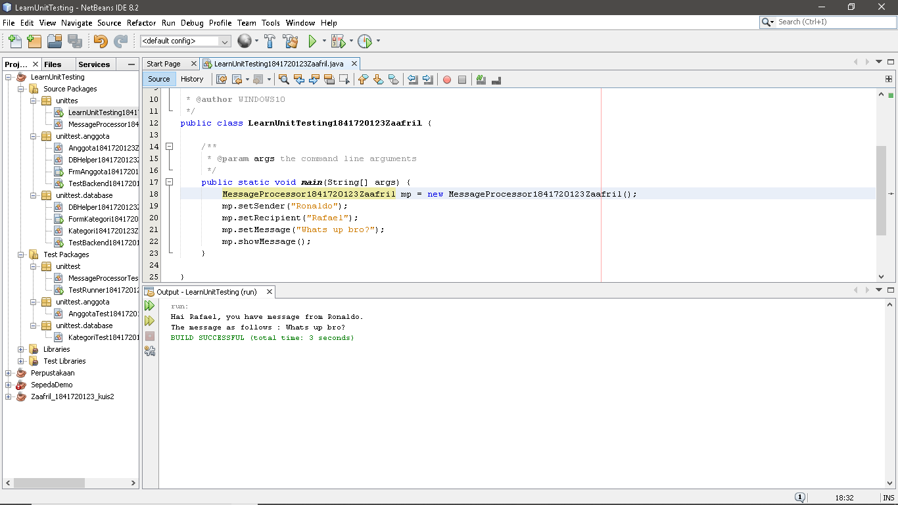
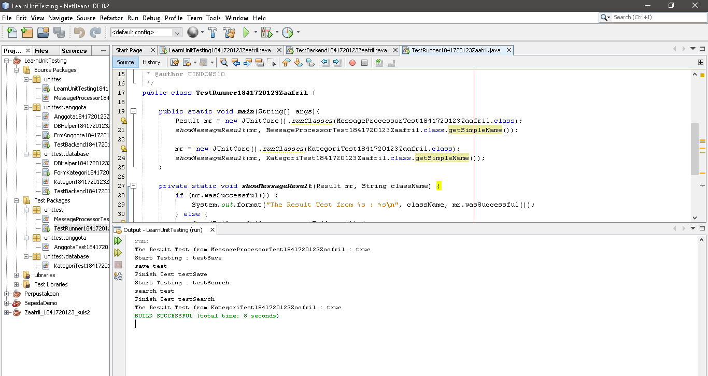
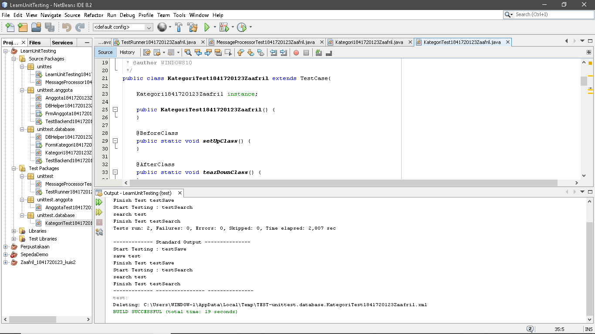
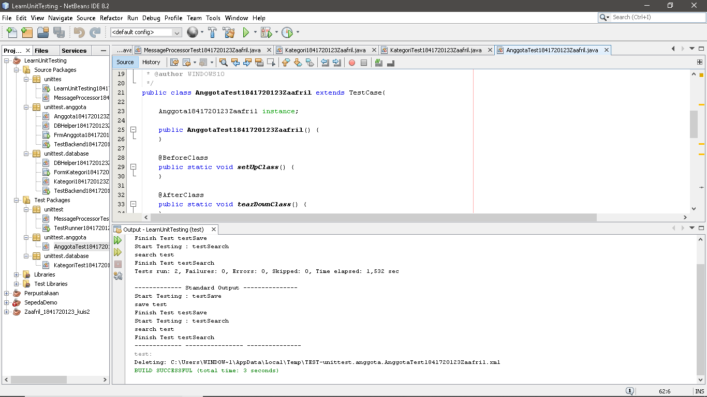

# Laporan Praktikum #15 - Unit Testing 

## Kompetensi

Setelah menyelesaikan lembar kerja ini mahasiswa diharapkan mampu:

1.	Memahami konsep dan fungsi unit testing
2.	Menerapkan unit testing dengan JUnit pada program sederhana.
3.	Menerapkan unit testing dengan JUnit pada progam yang terkoneksi database

## Percobaan

### Percobaan 1

- Class MessageProcessor1841720123Zaafril.java

Link kode program : [MessageProcessor1841720123Zaafril.java](../../src/15_Unit_Testing/src/unittes/MessageProcessor1841720123Zaafril.java)

- Class LearnUnitTesting1841720123Zaafril.java

Link kode program : [LearnUnitTesting1841720123Zaafril.java](../../src/15_Unit_Testing/src/unittes/LearnUnitTesting1841720123Zaafril.java)

- Class MessageProcessorTest1841720123Zaafril.java

Link kode program : [MessageProcessorTest1841720123Zaafril.java](../../src/15_Unit_Testing/test/unittest/MessageProcessorTest1841720123Zaafril.java)

- Class TestRunner1841720123Zaafril.java

Link kode program : [TestRunner1841720123Zaafril.java](../../src/15_Unit_Testing/test/unittest/TestRunner1841720123Zaafril.java)

### Percobaan 2

- Class Kategori1841720123Zaafril.java

Link kode program : [Kategori1841720123Zaafril.java](../../src/15_Unit_Testing/src/unittest/database/Kategori1841720123Zaafril.java)

- Class KategoriTest1841720123Zaafril.java

Link kode program : [KategoriTest1841720123Zaafril.java](../../src/15_Unit_Testing/test/unittest/database/KategoriTest1841720123Zaafril.java)

- Class DBHelper1841720123Zaafril.java

Link kode program : [DBHelper1841720123Zaafril.java](../../src/15_Unit_Testing/src/unittest/database/DBHelper1841720123Zaafril.java)

- Class FormKategori1841720123Zaafril.java

Link kode program : [FormKategori1841720123Zaafril.java](../../src/15_Unit_Testing/src/unittest/database/FormKategori1841720123Zaafril.java)

- Class TestBackend1841720123Zaafril.java

Link kode program : [TestBackend1841720123Zaafril.java](../../src/15_Unit_Testing/src/unittest/database/TestBackend1841720123Zaafril.java)

- Class TestRunner1841720123Zaafril.java

Link kode program : [TestRunner1841720123Zaafril.java](../../src/15_Unit_Testing/test/unittest/TestRunner1841720123Zaafril.java)

### Tugas

- Class Anggota1841720123Zaafril.java

Link kode program : [Anggota1841720123Zaafril.java](../../src/15_Unit_Testing/src/unittest/anggota/Anggota1841720123Zaafril.java)

- Class AnggotaTest1841720123Zaafril.java

Link kode program : [AnggotaTest1841720123Zaafril.java](../../src/15_Unit_Testing/test/unittest/anggota/AnggotaTest1841720123Zaafril.java)

- Class DBHelper1841720123Zaafril.java

Link kode program : [DBHelper1841720123Zaafril.java](../../src/15_Unit_Testing/src/unittest/anggota/DBHelper1841720123Zaafril.java)

- Class FrmAnggota1841720123Zaafril.java

Link kode program : [FrmAnggota1841720123Zaafril.java](../../src/15_Unit_Testing/src/unittest/anggota/FrmAnggota1841720123Zaafril.java)

- Class TestBackend1841720123Zaafril.java

Link kode program : [TestBackend1841720123Zaafril.java](../../src/15_Unit_Testing/src/unittest/anggota/TestBackend1841720123Zaafril.java)

## Kesimpulan

1.	Kita dapat memahami konsep dan fungsi unit testing

2.	Kita dapat menerapkan unit testing dengan JUnit pada program sederhana.

3.	Kita dapat menerapkan unit testing dengan JUnit pada progam yang terkoneksi database

## Pernyataan Diri

Saya menyatakan isi tugas, kode program, dan laporan praktikum ini dibuat oleh saya sendiri. Saya tidak melakukan plagiasi, kecurangan, menyalin/menggandakan milik orang lain.

Jika saya melakukan plagiasi, kecurangan, atau melanggar hak kekayaan intelektual, saya siap untuk mendapat sanksi atau hukuman sesuai peraturan perundang-undangan yang berlaku.

Ttd,

***(Muhammad Zaafril Sodik)***

