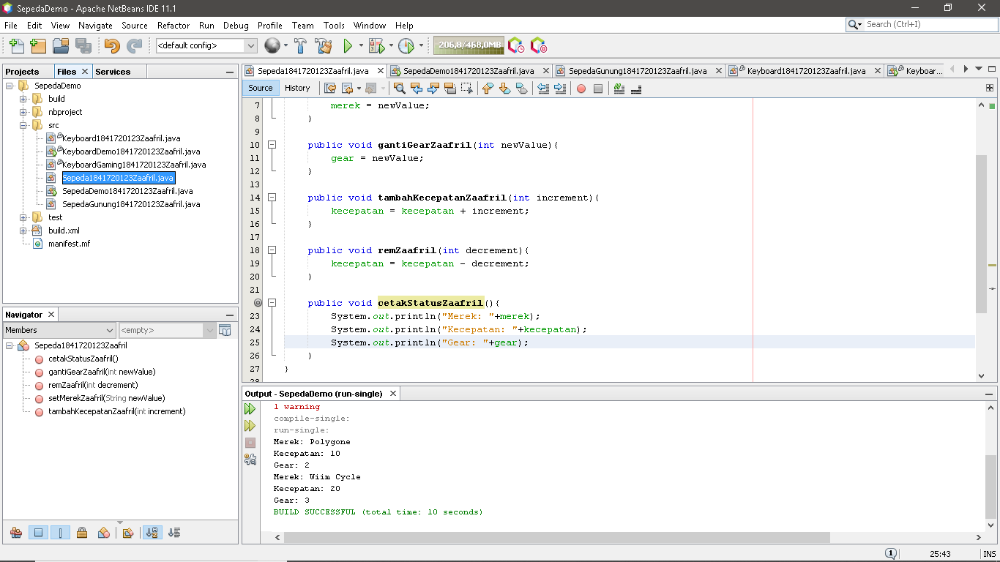
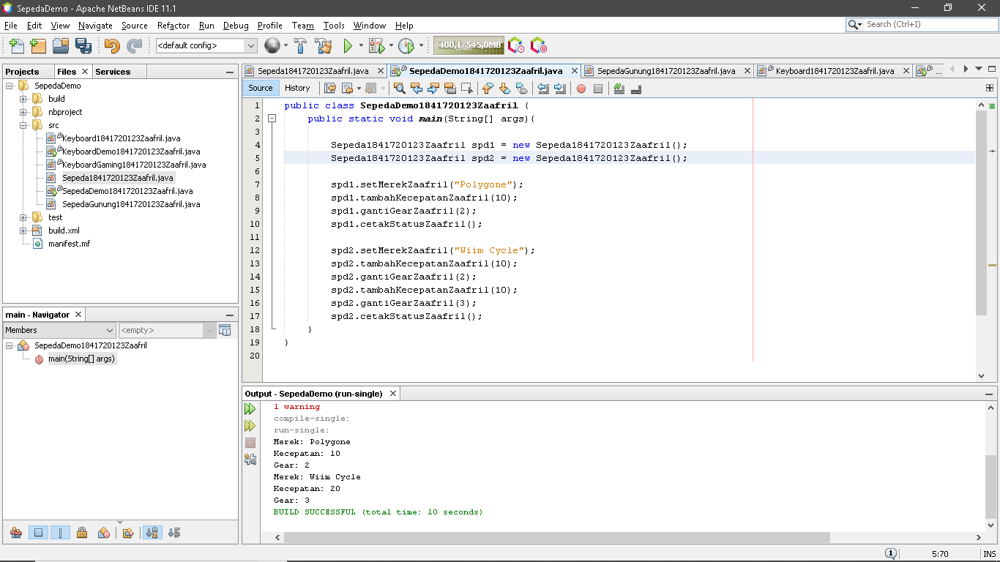
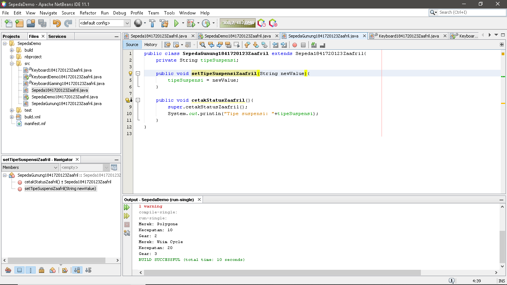
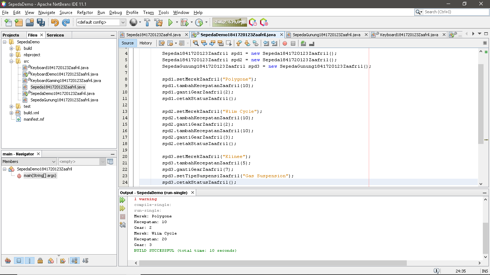
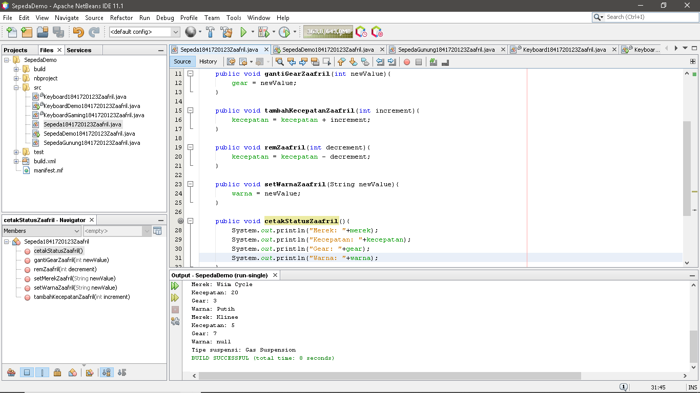
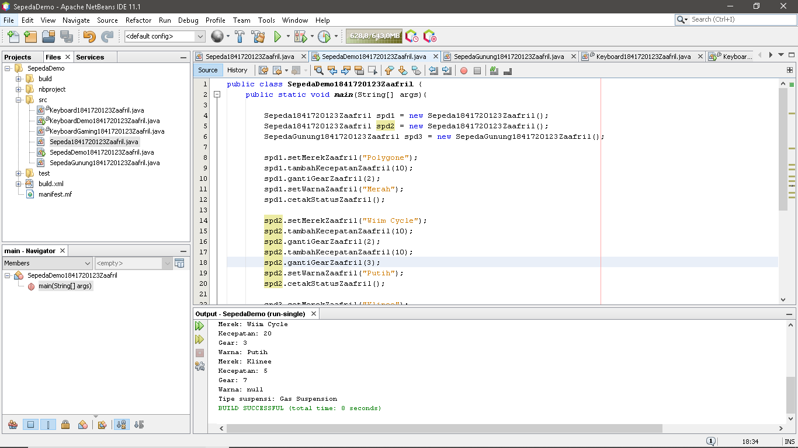
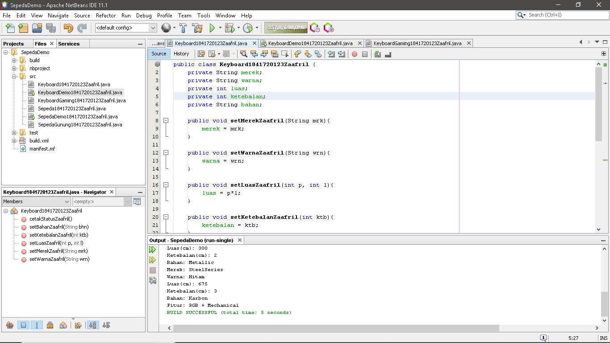
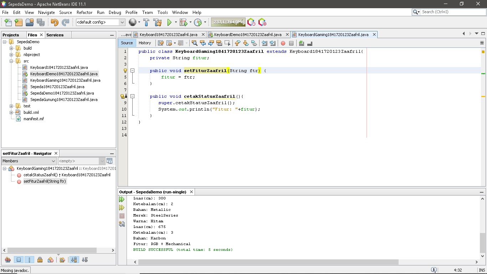
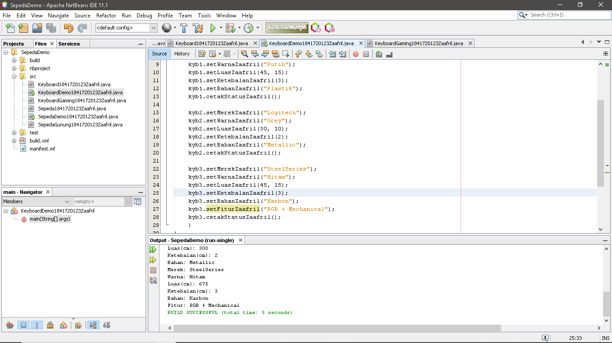

# Laporan Praktikum #1 - Pengantar Konsep PBO

## Kompetensi

Setelah menempuh materi percobaan ini, mahasiswa mampu mengenal:
1.Perbedaan paradigma berorientasi objek dengan paradigma struktural
2.Konsep dasar PBO

## Ringkasan Materi

Perbedaan mendasar antara pemrograman terstruktur dengan pemrograman berorientasi objek 
(PBO) atau Object Oriented Programming (OOP) adalah: Pada pemrograman terstruktur, program 
dipecah kedalam sub-program atau fungsi. Sedangkan pada PBO, program dipecah kedalam objek, 
dimana objek tersebut membungkus statedan method.

Kelebihan PBO adalah program dapat lebih fleksibel dan modular, jika ada perubahan fitur, maka 
dapat dipastikan keseluruhan program tidak akan terganggu. Berbeda dengan struktural, perubahan 
sedikit fitur saja kemungkinan dapat mengganggu keseluruhan program.

## Percobaan

### Percobaan 1

Didalam percobaan ini, kita akan mendemonstrasikan bagaimana membuat class, membuat object, 
kemudian mengakses method didalam class tersebut.

- Class Sepeda1841720123Zaafril.java

Link kode program : [Sepeda1841720123Zaafril.java](muhzaafrils/Laporan-Praktikum-PBO-2019/src/1_Pengantar_Konsep_PBO/Sepeda1841720123Zaafril.java)

- Class main, SepedaDemo1841720123Zaafril.java

Link kode program : [SepedaDemo1841720123Zaafril.java](muhzaafrils/Laporan-Praktikum-PBO-2019/src/1_Pengantar_Konsep_PBO/SepedaDemo1841720123Zaafril.java)

### Percobaan 2

Didalam percobaan ini, akan didemonstrasikan salah satu fitur yang paling penting dalam PBO, yaitu 
inheritance.Disini kita akan membuat class SepedaGunung yang mana adalah turunan/warisan dari 
class Sepeda. Pada dasarnya class SepedaGunung adalah sama dengan class Sepeda, hanya saja pada 
sepeda gunung terdapattipe suspensi. Untuk itu kita tidak perlu membuat class Sepeda Gunung dari 
nol, tapi kita wariskan saja class Sepeda ke class SepedaGunung.

- Class SepedaGunung1841720123Zaafril.java

Link kode program : [SepedaGunung1841720123Zaafril.java](muhzaafrils/Laporan-Praktikum-PBO-2019/src/1_Pengantar_Konsep_PBO/SepedaGung1841720123Zaafril.java)

- Class main, SepedaDemo1841720123Zaafril.java

Link kode program : [SepedaDemo1841720123Zaafril.java](muhzaafrils/Laporan-Praktikum-PBO-2019/src/1_Pengantar_Konsep_PBO/SepedaDemo1841720123Zaafril.java)

## Pertanyaan

1. Sebutkan dan jelaskan aspek-aspek yang ada pada pemrograman berorientasi objek!
- a. Object 
- Object adalah suatu rangkaian dalam program yang terdiri dari state dan behaviour. Object pada software dimodelkan sedemikian rupa sehingga mirip dengan objek yang ada di dunia nyata. Objek memiliki state dan behaviour. State adalah ciri-ciri atau atribut dari objek tersebut. 
- b. Class 
- Class adalah blueprint atau prototype dari objek. 
- c. Enkapsulasi 
- Disebut juga dengan information-hiding. 
- d. Inheritance 
- Disebut juga pewarisan. Inheritance memungkinkan kita untuk mengorganisir struktur program dengan natural. Inheritance juga memungkinkan kita untuk memperluas fungsionalitas program tanpa harus mengubah banyak bagian program. 
- e. Polimorfisme 
- Polimorfisme juga meniru sifat objek di dunia nyata, dimana sebuah objek dapat memiliki bentuk, atau menjelma menjadi bentuk-bentuk lain. 
2. Apa yang dimaksud dengan object dan apa bedanya dengan class?
-   a.Object adalah suatu rangkaian dalam program yang terdiri dari state dan behaviour
-   b.Class adalah blueprint atau prototype dari objek.
-   Perbedaannya : class merupakan rancangan (design) dan bersifat abstract, sedangkan Object 
    merupakan perwujudan suatu class dan bersifat konkrit
3. Sebutkan salah satu kelebihan utama dari pemrograman berorientasi objek dibandingkan dengan 
pemrograman struktural!
-   Kelebihan PBO adalah program dapat lebih fleksibeldan modular, jika ada perubahan fitur, 
    maka dapat dipastikan keseluruhan program tidak akan terganggu. 
4. Pada class Sepeda, terdapat state/atribut apa saja?
-   merek, kecepatan, gear
5. Tambahkan atribut warna pada class Sepeda.
-   Class Sepeda1841720123Zaafril.java
    

    Link kode program : [Sepeda1841720123Zaafril.java](muhzaafrils/Laporan-Praktikum-PBO-2019/src/1_Pengantar_Konsep_PBO/Sepeda1841720123Zaafril.java)

-   Class main, SepedaDemo1841720123Zaafril.java
    

    Link kode program : [SepedaDemo1841720123Zaafril.java](muhzaafrils/Laporan-Praktikum-PBO-2019/src/1_Pengantar_Konsep_PBO/SepedaDemo1841720123Zaafril.java)
6. Mengapa pada saat kita membuat class SepedaGunung, kita tidak perlu membuat class nya dari nol?
-   Karena class SepedaGunung merupakan turunan dari kelas Sepeda, maka pada saat membuat class SepedaGunung 
    tidak perlu membuat classnya dari awal karena sebagian atribut dan method sudah ada di class Sepeda

## Tugas

- Class Keyboard1841720123Zaafril.java

Link kode program : [Keyboard1841720123Zaafril.java](muhzaafrils/Laporan-Praktikum-PBO-2019/src/1_Pengantar_Konsep_PBO/Keyboard1841720123Zaafril.java)

- Class KeyboardGaming1841720123Zaafril.java

Link kode program : [KeyboardGaming1841720123Zaafril.java](muhzaafrils/Laporan-Praktikum-PBO-2019/src/1_Pengantar_Konsep_PBO/KeyboardGaming1841720123Zaafril.java)

- Class KeyboardDemo1841720123Zaafril.java

Link kode program : [KeyboardDemo1841720123Zaafril.java](muhzaafrils/Laporan-Praktikum-PBO-2019/src/1_Pengantar_Konsep_PBO/KeyboardDemo1841720123Zaafril.java)

## Kesimpulan

- Kita dapat mendemonstrasikan bagaimana cara pemrograman berorientasi objek dapat diimplementasikan kedalam program sederhana.
- Kita dapat membuat fitur dari class satu ke class lainnya dengan menggunakan "extends" dan ini merupakan kelebihan PBO yang tidak ada di 
pemrograman struktural.

## Pernyataan Diri

Saya menyatakan isi tugas, kode program, dan laporan praktikum ini dibuat oleh saya sendiri. Saya tidak melakukan plagiasi, kecurangan, menyalin/menggandakan milik orang lain.

Jika saya melakukan plagiasi, kecurangan, atau melanggar hak kekayaan intelektual, saya siap untuk mendapat sanksi atau hukuman sesuai peraturan perundang-undangan yang berlaku.

Ttd,

***(Muhammad Zaafril Sodik)***
