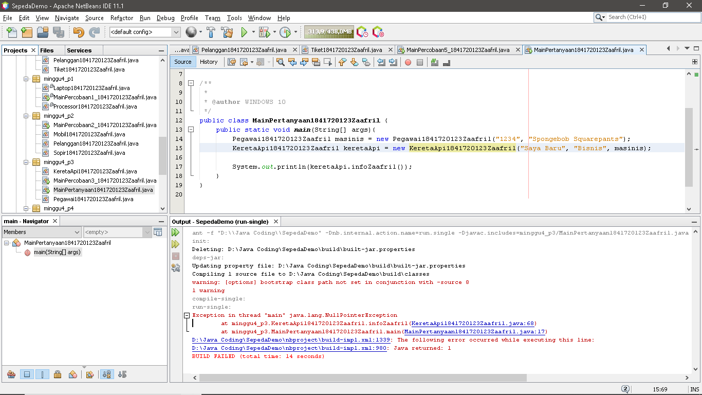

# Laporan Praktikum #4 - Relasi Class

## Kompetensi

Setelah menempuh pokok bahasan ini, mahasiswa mampu: 
1. Memahami konsep relasi kelas
2. Mengimplementasikan relasi has‑a dalam program. 

## Ringkasan Materi

Pada kasus yang lebih kompleks, dalam suatu sistem akan ditemukan lebih dari satu class yang saling memiliki keterkaitan antara class satu dengan yang lain. Pada percobaan‑percobaan sebelumnya, mayoritas kasus yang sudah dikerjakan hanya fokus pada satu class saja. Pada jobsheet ini akan dilakukan percobaan yang melibatkan beberapa class yang saling berelasi. 

Relasi dalam class dinyatakan dalam one‑to‑one. Tetapi ada kalanya relasi class melibatkan lebih dari satu. Hal ini disebut dengan multiplicity. Untuk relasi lebih rinci mengenai multiplicity, dapat dilihat pada tabel berikut. 
 
|  |  |
|--|--|
| Multiplicity | Keterangan | 
| 0..1 | 0 atau 1 instance | 
| 1 | Tepat 1 instance | 
| 0..* | 0 atau lebih instance | 
|1..* | setidaknya 1 instance | 
| n | Tepat n instance (n diganti dengan sebuah angka) |
| m..n | Setidaknya m instance, tetapi tidak lebih dari n |

## Percobaan

### Percobaan 1

Terdapat class Laptop yang memiliki atribut berupa merk dan prosesor. Jika diperhatikan lebih rinci, maka atribut prosesor sendiri didalamnya memiliki data berupa merk, nilai cache memori, dan nilai clock‑nya. Artinya, ada class lain yang namanya Processor yang memiliki atribut merk, cache dan clock, dan atribut prosesor yang ada di dalam class Laptop itu merupakan objek dari class Proceessor tersebut. Sehingga terlihat antara class Laptop dan class Processor memiliki relasi (has‑a). 

- Class Laptop1841720123Zaafril.java

Link kode program : [Laptop1841720123Zaafril.java](../../src/4_Relasi_Class/Laptop1841720123Zaafril.java)

- Class Processor1841720123Zaafril.java

Link kode program : [Processor1841720123Zaafril.java](../../src/4_Relasi_Class/Processor1841720123Zaafril.java)

- Class Main, MainPercobaan1_1841720123Zaafril.java

Link kode program : [MainPercobaan1_1841720123Zaafril.java](../../src/4_Relasi_Class/MainPercobaan1_1841720123Zaafril.java)

## Pertanyaan Percobaan 1
Berdasarkan percobaan 1, jawablah pertanyaan‑pertanyaan yang terkait: 
1. Di dalam class Processor dan class Laptop , terdapat method setter dan getter untuk masing‑masing atributnya. Apakah gunanya method setter dan getter tersebut ? 
- Method setter untuk mengeset nilai dari class sedangkan method getter untuk mendapatkan nilai dari atribut class

2. Di dalam class Processor dan class Laptop, masing‑masing terdapat konstruktor default dan konstruktor berparameter. Bagaimanakah beda penggunaan dari kedua jenis konstruktor tersebut ?
- Perbedaan dari kedua konstruktur tersebut adalah salah satu nya memiliki parameter dan mengeset nilai atribut pada saat instansiasi, sedangkan yg satunya merupakan konstruktor default 

3. Perhatikan class Laptop, di antara 2 atribut yang dimiliki (merk dan proc), atribut manakah yang bertipe object ?
- Atribur proc

4. Perhatikan class Laptop, pada baris manakah yang menunjukan bahwa class Laptop memiliki relasi dengan class Processor ?
- private Processor1841720123Zaafril proc;

5. Perhatikan pada class Laptop , Apakah guna dari sintaks proc.info() ? 
- Untuk memanggil method infoZaafril() yang ada pada atribut proc

6. Pada class MainPercobaan1, terdapat baris kode: 
Laptop l = new Laptop("Thinkpad", p);. 
Apakah p tersebut ? Dan apakah yang terjadi jika baris kode tersebut diubah menjadi: 
Laptop l = new Laptop("Thinkpad", new Processor("Intel i5", 3));
Bagaimanakah hasil program saat dijalankan, apakah ada perubahan ?
- p adalah objek dari processor, sama saja tidak ada perubahan 

### Percobaan 2

Diagram class berikut yang menggambarkan sistem rental mobil. Pelanggan bisa menyewa mobil sekaligus sopir. Biaya sopir dan biaya sewa mobil dihitung per hari. 

- Class Sopir1841720123Zaafril.java

Link kode program : [Sopir1841720123Zaafril.java](../../src/4_Relasi_Class/Laptop1841720123Zaafril.java)

- Class Pelanggan1841720123Zaafril.java

Link kode program : [Pelanggan1841720123Zaafril.java](../../src/4_Relasi_Class/Pelanggan1841720123Zaafril.java)

- Class Mobil1841720123Zaafril.java

Link kode program : [Mobil1841720123Zaafril.java](../../src/4_Relasi_Class/Mobil1841720123Zaafril.java)

- Class Main, MainPercobaan2_1841720123Zaafril.java 

Link kode program : [MainPercobaan2_1841720123Zaafril.java](../../src/4_Relasi_Class/MainPercobaan2_1841720123Zaafril.java)

## Pertanyaan Percobaan 2

1. Perhatikan class Pelanggan. Pada baris program manakah yang menunjukan bahwa class Pelanggan memiliki relasi dengan class Mobil dan class Sopir ? 
-   private Mobil1841720123Zaafril mobil;
    private Sopir1841720123Zaafril sopir;

2. Perhatikan method hitungBiayaSopir pada class Sopir, serta method hitungBiayaMobil pada class Mobil. Mengapa menurut Anda method tersebut harus memiliki argument hari ? 
- Karena pada method hitungBayarSopirZaafril diperlukan sejumlah hari untuk menghitung hasil biaya. Sedangkan argumen hari merupakan nilai yang ditentukan oleh user, bukan oleh objek itu sendiri

3. Perhatikan kode dari class Pelanggan. Untuk apakah perintah mobil.hitungBiayaMobil(hari) dan sopir.hitungBiayaSopir(hari) ? 
- Untuk mendapatkan masing-masing biaya sewa mobil dan biaya sewa sopir

4. Perhatikan class MainPercobaan2. Untuk apakah sintaks p.setMobil(m) dan p.setSopir(s) ? 
- Untuk mengeset atribut mobil dan sopir pada objek p(penumpang)

5. Perhatikan class MainPercobaan2. Untuk apakah proses p.hitungBiayaTotal() tersebut ?
- Untuk menghitung biaya total yang didapatkan dari penjumlahan biaya sewa mobil dan biaya sewa sopir

6. Perhatikan class MainPercobaan2, coba tambahkan pada baris terakhir dari method main dan amati perubahan saat di‑run!
System.out.println(p.getMobil().getMerk()); 
Jadi untuk apakah sintaks p.getMobil().getMerk() yang ada di dalam method main tersebut? 
- Untuk mendapatkan nama merk dari mobil yang menjadi atribut dari objek p(penumpang)

### Percobaan 3

- Class KeretaApi1841720123Zaafril.java

Link kode program : [KeretaApi1841720123Zaafril.java](../../src/4_Relasi_Class/KeretaApi1841720123Zaafril.java)

- Class Pegawai1841720123Zaafril.java

Link kode program : [Pegawai1841720123Zaafril.java](../../src/4_Relasi_Class/Pegawai1841720123Zaafril.java)

- Class Main, MainPercobaan3_1841720123Zaafril.java

Link kode program : [MainPercobaan3_1841720123Zaafril.java](../../src/4_Relasi_Class/MainPercobaan3_1841720123Zaafril.java)

### Pertanyaan Percobaan 3

1. Di dalam method info() pada class KeretaApi, baris this.masinis.info() dan this.asisten.info() digunakan untuk apa ? 
- Untuk memanggil method infoZaafril() yang berada di dalam objek masinis dan asisten untuk menampilkan info dari onjek tersebut

2. Buatlah main program baru dengan nama class MainPertanyaan pada package yang sama. Tambahkan kode berikut pada method main() ! 
 
Pegawai masinis = new Pegawai("1234", "Spongebob Squarepants"); KeretaApi keretaApi = new KeretaApi("Gaya Baru", "Bisnis", masinis); 
 
System.out.println(keretaApi.info()); 

- Class MainPertanyaan.java

Link kode program : [MainPertanyaan1841720123Zaafril.java](../../src/4_Relasi_Class/MainPertanyaan1841720123Zaafril.java)
 
3. Apa hasil output dari main program tersebut ? Mengapa hal tersebut dapat terjadi ? 
- Karena pada pemanggilan method infoZaafril(), methodnya membutuhkan objek masinis, 

4. Perbaiki class KeretaApi sehingga program dapat berjalan !

- Class MainPertanyaan.java

Link kode program : [MainPertanyaan1841720123Zaafril.java](../../src/4_Relasi_Class/MainPertanyaan1841720123Zaafril.java)

### Percobaan 4

- Class Penumpang1841720123Zaafril.java

Link kode program : [Penumpang1841720123Zaafril.java](../../src/4_Relasi_Class/Penumpang1841720123Zaafril.java)

- Class Kursi1841720123Zaafril.java

Link kode program : [Kursi1841720123Zaafril.java](../../src/4_Relasi_Class/Kursi1841720123Zaafril.java)

- Class Gerbong1841720123Zaafril.java

Link kode program : [Gerbong1841720123Zaafril.java](../../src/4_Relasi_Class/Gerbong1841720123Zaafril.java)

- Class Main, MainPercobaan4_1841720123Zaafril.java

Link kode program : [MainPercobaan4_1841720123Zaafril.java](../../src/4_Relasi_Class/MainPercobaan4_1841720123Zaafril.java)

### Pertanyaan Percobaan 4

1. Pada main program dalam class MainPercobaan4, berapakah jumlah kursi dalam Gerbong A ? 
- Jumlah kursi dalam Gerbong A ada 10 kursi 

2. Perhatikan potongan kode pada method info() dalam class Kursi. Apa maksud kode tersebut ? 
 
... if (this.penumpang != null) { info += "Penumpang: " + penumpang.info() + "\n"; } ... 

-  Maksud dari kode tersebut adalah, jika penumpang tidak kosong maka akan dikeluarkan data pada class Penumpang di method infoZaafril()

3. Mengapa pada method setPenumpang() dalam class Gerbong, nilai nomor dikurangi dengan angka 1 ? 
- Nilai nomor dikurangi dengan angka 1 pada method setPenumpangZaafril() dikarenakan index array dimulai dari angka 0 

4. Instansiasi objek baru budi dengan tipe Penumpang, kemudian masukkan objek baru tersebut pada gerbong dengan gerbong.setPenumpang(budi, 1). Apakah yang terjadi ? 
- Yang terjadi adalah, data budi tetap keluar akan tetapi menggunakan kursi yang telah digunakan oleh orang lain 

5. Modifikasi program sehingga tidak diperkenankan untuk menduduki kursi yang sudah ada penumpang lain ! 

- Class Main, MainPercobaan4.java

Link kode program : [MainPercobaan4_1841720123Zaafril.java](../../src/4_Relasi_Class/MainPercobaan4_1841720123Zaafril.java)

## Tugas

Buatlah sebuah studi kasus, rancang dengan class diagram, kemudian implementasikan ke dalam program! Studi kasus harus mewakili relasi class dari percobaan‑percobaan yang telah dilakukan pada materi ini, setidaknya melibatkan minimal 4 class (class yang berisi main tidak dihitung). 
 
- Class Loket1841720123Zaafril.java

Link kode program : [Loket1841720123Zaafril.java](../../src/4_Relasi_Class/Loket1841720123Zaafril.java)

- Class Pegawai1841720123Zaafril.java

Link kode program : [Pegawai1841720123Zaafril.java](../../src/4_Relasi_Class/PegawaiB1841720123Zaafril.java)

- Class Pelanggan1841720123Zaafril.java

Link kode program : [Pelanggan1841720123Zaafril.java](../../src/4_Relasi_Class/PelangganB1841720123Zaafril.java)

- Class Main, MainPercobaan5_1841720123Zaafril.java

Link kode program : [MainPercobaan5_1841720123Zaafril.java](../../src/4_Relasi_Class/MainPercobaan5_1841720123Zaafril.java)

## Kesimpulan

- Kita dapat memahami konsep relasi class
- Kita dapat mengimplementasikan relasi has-a dalam program

## Pernyataan Diri

Saya menyatakan isi tugas, kode program, dan laporan praktikum ini dibuat oleh saya sendiri. Saya tidak melakukan plagiasi, kecurangan, menyalin/menggandakan milik orang lain.

Jika saya melakukan plagiasi, kecurangan, atau melanggar hak kekayaan intelektual, saya siap untuk mendapat sanksi atau hukuman sesuai peraturan perundang-undangan yang berlaku.

Ttd,

***(Muhammad Zaafril Sodik)***
