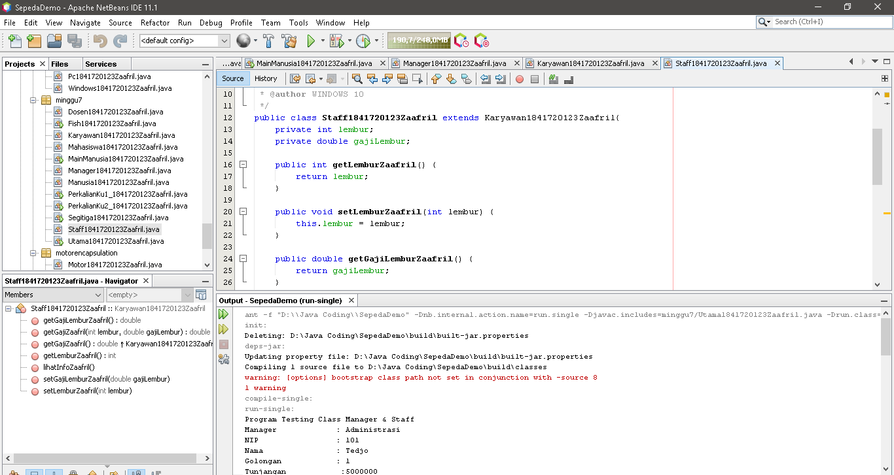
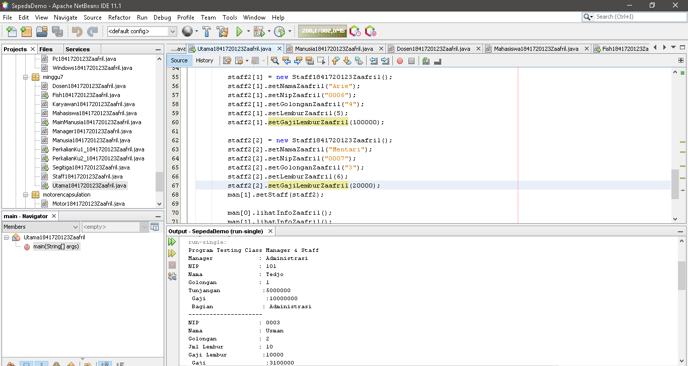

# Laporan Praktikum #7 - Overloading dan Overriding

## Kompetensi

a.	Memahami konsep overloading dan overriding,

b.	Memahami perbedaan overloading dan overriding,

c.	Ketepatan dalam mengidentifikasi method overriding dan overloading

d.	Ketepatan dalam mempraktekkan instruksi pada jobsheet

e.	Mengimplementasikan method overloading dan overriding.

## Ringkasan Materi

Overloading adalah menuliskan kembali method
dengan nama yang sama pada suatu class. Tujuannya dapat memudahkan penggunaan/pemanggilan method dengan fungsionalitas yang mirip. 

Overriding adalah Sublass yang berusaha memodifkasi tingkah laku yang diwarisi dari superclass. Tujuannya subclass dapat memiliki tingkah laku yang lebih spesifik sehingga dapat dilakukan dengan cara mendeklarasikan kembali method milik parent class di subclass. Deklarasi method pada subclass harus sama dengan yang terdapat di super class.

## Percobaan

### Percobaan 1

Untuk kasus contoh berikut ini, terdapat tiga kelas, yaitu Karyawan, Manager, dan Staff. Class Karyawan merupakan superclass dari Manager dan Staff dimana subclass Manager dan Staff memiliki method untuk menghitung gaji yang berbeda.

- Class Karyawan1841720123Zaafril

Link kode program : [Karyawan1841720123Zaafril.java](../../src/7_Overriding_dan_Overloading/Karyawan1841720123Zaafril.java)

- Class Manager1841720123Zaafril

Link kode program : [Manager1841720123Zaafril.java](../../src/7_Overriding_dan_Overloading/Manager1841720123Zaafril.java)

- Class Staff1841720123Zaafril

Link kode program : [Staff1841720123Zaafril.java](../../src/7_Overriding_dan_Overloading/Staff1841720123Zaafril.java)

- Class Utama1841720123Zaafril

Link kode program : [Utama1841720123Zaafril.java](../../src/7_Overriding_dan_Overloading/Utama1841720123Zaafril.java)

### Latihan

Class PerkalianKu1_1841720123Zaafril

Link kode program : [PerkalianKu1_1841720123Zaafril.java](../../src/7_Overriding_dan_Overloading/PerkalianKu1_1841720123Zaafril.java)

4. 1 Dari source coding diatas terletak dimanakah overloading?
- Pada objek.perkalian karena jumlah parameternya berbeda

4. 2 Jika terdapat overloading ada berapa jumlah parameter yang berbeda?
- 2 tipe parameter dengan jumlah parameter yang berbeda yaitu 2 dan 3	

Class PerkalianKu2_1841720123Zaafril

Link kode program : [PerkalianKu2_1841720123Zaafril.java](../../src/7_Overriding_dan_Overloading/PerkalianKu2_1841720123Zaafril.java)

4. 3 Dari source coding diatas terletak dimanakah overloading?
- pada objek.perkalian karena parameternya berbeda

4. 4 Jika terdapat overloading ada berapa tipe parameter yang berbeda?
- 2 tipe parameter yaitu tipe double dan tipe integer

Class Fish1841720123Zaafril

Link kode program : [Fish1841720123Zaafril.java](../../src/7_Overriding_dan_Overloading/Fish1841720123Zaafril.java)

4. 5 Dari source coding diatas terletak dimanakah overriding?
- Terletak pada class Piranha1841720123Zaafril, karena class ini berusaha memodifikasi tingkah laku dari superclass yaitu class Ikan1841720123Zaafril

4. 6 Jabarkanlah apabila sourcoding diatas jika terdapat overriding?
-   1. Pada pada class Ikan1841720123Zaafril dan class Piranha1841720123Zaafril memiliki nama method yang sama
	2. Class Piranha1841720123Zaafril merupakan subclass dari class Ikan1841720123Zaafril
	3. Mode akses  overriding  method swimZaafril()  sama dengan  overridden method.

## Tugas

### Overloading

- Class Segitiga1841720123Zaafril

Link kode program : [Segitiga1841720123Zaafril.java](../../src/7_Overriding_dan_Overloading/Segitiga1841720123Zaafril.java)

### Overriding

- Class Manusia1841720123Zaafril

Link kode program : [Manusia1841720123Zaafril.java](../../src/7_Overriding_dan_Overloading/Manusia1841720123Zaafril.java)

- Class Dosen1841720123Zaafril

Link kode program : [Dosen1841720123Zaafril.java](../../src/7_Overriding_dan_Overloading/Dosen1841720123Zaafril.java)

- Class Mahasiswa1841720123Zaafril

Link kode program : [Mahasiswa1841720123Zaafril.java](../../src/7_Overriding_dan_Overloading/Mahasiswa1841720123Zaafril.java)

- Class MainManusia1841720123Zaafril

Link kode program : [MainManusia1841720123Zaafril.java](../../src/7_Overriding_dan_Overloading/MainManusia1841720123Zaafril.java)

## Kesimpulan

a.	Kita dapat memahami konsep overloading dan overriding,

b.	Kita dapat memahami perbedaan overloading dan overriding,

c.	Kita dapat mengidentifikasi method overriding dan overloading

d.	Kita dapat mempraktekkan ketepatan instruksi pada jobsheet

e.	Kita dapat mengimplementasikan method overloading dan overriding.

## Pernyataan Diri

Saya menyatakan isi tugas, kode program, dan laporan praktikum ini dibuat oleh saya sendiri. Saya tidak melakukan plagiasi, kecurangan, menyalin/menggandakan milik orang lain.

Jika saya melakukan plagiasi, kecurangan, atau melanggar hak kekayaan intelektual, saya siap untuk mendapat sanksi atau hukuman sesuai peraturan perundang-undangan yang berlaku.

Ttd,

***(Muhammad Zaafril Sodik)***