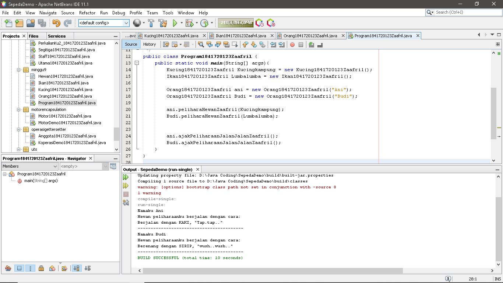
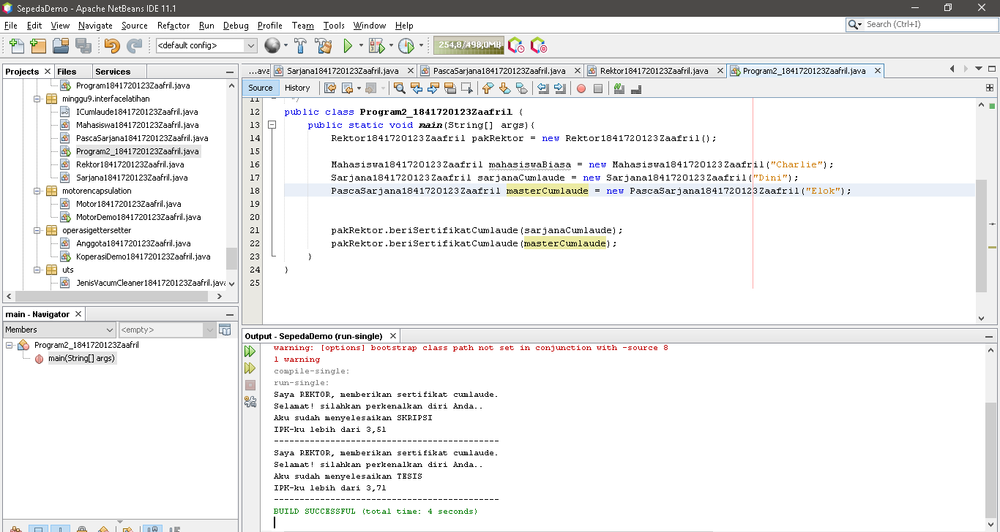
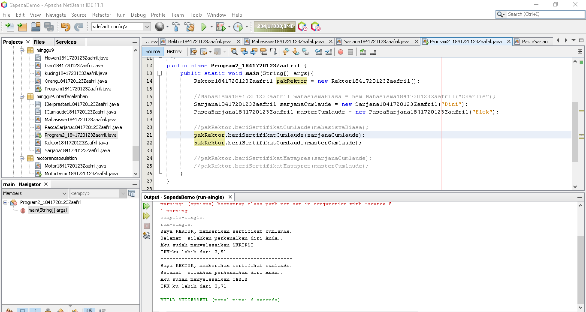
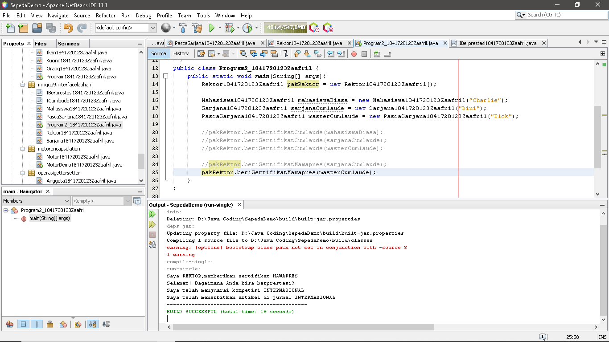
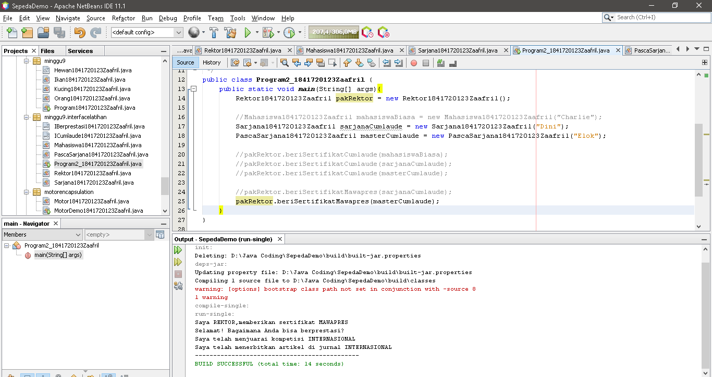

# Laporan Praktikum #9 - Abstract Class dan Interface

## Kompetensi

Setelah menyelesaikan lembar kerja ini mahasiswa diarapkan mampu:

1.	Menjelaskan maksud dan tujuan penggunaan Abstract Class
2.	Menjelaskan maksud dan tujuan penggunaan Interface
3.	Menggunakan Abstract Class dan Interface di dalam pembuatan program

## Ringkasan Materi

- Abstract Class adalah Class yang tidak dapat diinstansiasi namun dapat di-extend.

- Kegunaan Abstract Class adalah menggambarkan sesuatu yang bersifat umum, yang hanya bisa berfungsi setelah ia dideskripsikan kedalam bentuk yang lebih spesifik.

- Interface adalah Struktur data yang hanya berisi abstract methods. Tidak ada apa-apa selain method abstract pada interface, termasuk atribute getter dan setter.

- Kegunaan Interface adalah Bertindak seperti semacam kontrak/syarat yang HARUS dipenuhi bagi suatu class agar class tersebut dapat dianggap sebagai ‘sesuatu yang lain’.

## Percobaan

### Percobaan 1

- Class Hewan1841720123Zaafril.java

Link kode program : [Hewan1841720123Zaafril.java](../../src/9_Abstract_Class_dan_Interface/Hewan1841720123Zaafril.java)

- Class Kucing1841720123Zaafril.java

Link kode program : [Kucing1841720123Zaafril.java](../../src/9_Abstract_Class_dan_Interface/Kucing1841720123Zaafril.java)

- Class Ikan1841720123Zaafril.java

Link kode program : [Ikan1841720123Zaafril.java](../../src/9_Abstract_Class_dan_Interface/Ikan18417201423Zaafril.java)

- Class Orang1841720123Zaafril.java

Link kode program : [Orang1841720123Zaafril.java](../../src/9_Abstract_Class_dan_Interface/Orang1841720123Zaafril.java)

- Main Class, Program1841720123Zaafril.java

Link kode program : [Program1841720123Zaafril.java](../../src/9_Abstract_Class_dan_Interface/Program1841720123Zaafril.java)

## Pertanyaan Percobaan 1

- Bolehkah apabila sebuah class yang meng-extend suatu abstract class tidak mengimplementasikan method abstract yang ada di class induknya? Buktikan

- Tidak boleh, karena kelas turunan harus mengoverride method yang ada dari kelas induk dan jika tidak maka akan terjadi error, misalnya di kelas Kucing1841720123Zaafril dihapus method bergerakZaafril(), maka akan muncul error

### Percobaan 2

- Class ICumlaude1841720123Zaafril.java

Link kode program : [ICumlaude1841720123Zaafril.java](../../src/9_Abstract_Class_dan_Interface/ICumlaude1841720123Zaafril.java)

- Class Mahasiswa1841720123Zaafril.java

Link kode program : [Mahasiswa1841720123Zaafril.java](../../src/9_Abstract_Class_dan_Interface/Mahasiswa1841720123Zaafril.java)

- Class Sarjana1841720123Zaafril.java

Link kode program : [Sarjana1841720123Zaafril.java](../../src/9_Abstract_Class_dan_Interface/Sarjana1841720123Zaafril.java)

- Class PascaSarjana1841720123Zaafril.java

Link kode program : [PascaSarjana1841720123Zaafril.java](../../src/9_Abstract_Class_dan_Interface/PascaSarjana1841720123Zaafril.java)

- Class Rektor1841720123Zaafril.java

Link kode program : [Rektor1841720123Zaafril.java](../../src/9_Abstract_Class_dan_Interface/Rektor1841720123Zaafril.java)

- Main Class, Program2_1841720123Zaafril.java

Link kode program : [Program2_1841720123Zaafril.java](../../src/9_Abstract_Class_dan_Interface/Program2_1841720123Zaafril.java)

## Pertanyaan Percobaan 2

a. Mengapa pada langkah nomor 9 terjadi error?Jelaskan! 

- Karena pada class Mahasiswa1841720123Zaafril tidak ter implementasi interfaces dari ICumlaude1841720123Zaafril sehingga error ketika akan dipanggil oleh ‘pakRektor’ 

b. Dapatkah method kuliahDiKampus() dipanggil dari objek sarjanaCumlaude di class Program? Mengapa demikian?

- Bisa, karena sarjanaCumlaude dari class Sarjana18417200123Zaafril adalah kelas turunan dari Mahasiswa181720123Zaafril, sehingga method kuliahDiKampus bisa dipanggil ke class Sarjana1841720123Zaafril

c. Dapatkah method kuliahDiKampus() dipanggil dari parameter mahasiswa di method beriSertifikatCumlaude() pada class Rektor? Mengapa demikian?

- Tidak bisa, karena class rektor hanya menggunakan implementasi dari ICumlaude, dan kuliahDiKampus dari Mahasisw1841720123Zaafril tidak pernah di inisiasi di class Rektor1841720123Zaafril 

d. Modifikasilah method beriSertifikatCumlaude() pada class Rektor agar hasil eksekusi class Program menjadi seperti berikut ini: 

### Percobaan 3

- Class ICumlaude1841720123Zaafril.java

Link kode program : [ICumlaude1841720123Zaafril.java](../../src/9_Abstract_Class_dan_Interface/ICumlaude1841720123Zaafril.java)

- Class IBerprestasi1841720123Zaafril.java

Link kode program : [IBerprestasi1841720123Zaafril.java](../../src/9_Abstract_Class_dan_Interface/IBerprestasi1841720123Zaafril.java)

- Class Mahasiswa1841720123Zaafril.java

Link kode program : [Mahasiswa1841720123Zaafril.java](../../src/9_Abstract_Class_dan_Interface/Mahasiswa1841720123Zaafril.java)

- Class PascaSarjana1841720123Zaafril.java

Link kode program : [PascaSarjana1841720123Zaafril.java](../../src/9_Abstract_Class_dan_Interface/PascaSarjana1841720123Zaafril.java)

- Class Sarjana1841720123Zaafril.java

Link kode program : [Sarjana1841720123Zaafril.java](../../src/9_Abstract_Class_dan_Interface/Sarjana1841720123Zaafril.java)

- Class Rektor1841720123Zaafril.java

Link kode program : [Rektor1841720123Zaafril.java](../../src/9_Abstract_Class_dan_Interface/Rektor1841720123Zaafril.java)

- Class Program2_1841720123Zaafril.java

Link kode program : [Program2_1841720123Zaafril.java](../../src/9_Abstract_Class_dan_Interface/Program2_1841720123Zaafril.java)

## Pertanyaan Percobaan 3

Apabila Sarjana Berprestasi harus menjuarai kompetisi NASIONAL dan menerbitkan artikel di jurnal NASIONAL, 
maka modifikasilah class-class yang terkait pada aplikasi Anda agar di class Program objek pakRektor dapat 
memberikan sertifikat mawapres pada objek sarjanaCumlaude. 

  
## Kesimpulan

- Kita dapat menjelaskan maksud dan tujuan penggunaan Abstract Class
- Kita dapat menjelaskan maksud dan tujuan penggunaan Interface
- Kita dapat menggunakan Abstract Class dan Interface di dalam pembuatan program

## Pernyataan Diri

Saya menyatakan isi tugas, kode program, dan laporan praktikum ini dibuat oleh saya sendiri. Saya tidak melakukan plagiasi, kecurangan, menyalin/menggandakan milik orang lain.

Jika saya melakukan plagiasi, kecurangan, atau melanggar hak kekayaan intelektual, saya siap untuk mendapat sanksi atau hukuman sesuai peraturan perundang-undangan yang berlaku.

Ttd,

***(Muhammad Zaafril Sodik)***

